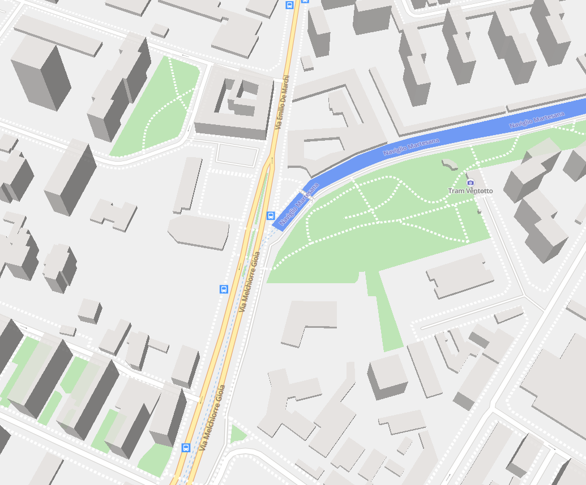

# Vector tiles demo

In this repo you can see a static map of Milan, Italy, working without external services (except the CDN for the Javascript libraries, also optional).

Also see the [article with the technical explanation](https://jacopofarina.eu/posts/static-maps-part-2-vector-tiles/)

## Usage

`python3 -m http.server`, then visit http://127.0.0.1:8000/index_mapgl.html

Note that some parts of the map may fail to render, that's because they contain characters outside the 0-255 codepoint range and those font files are not included to reduce the repository size
